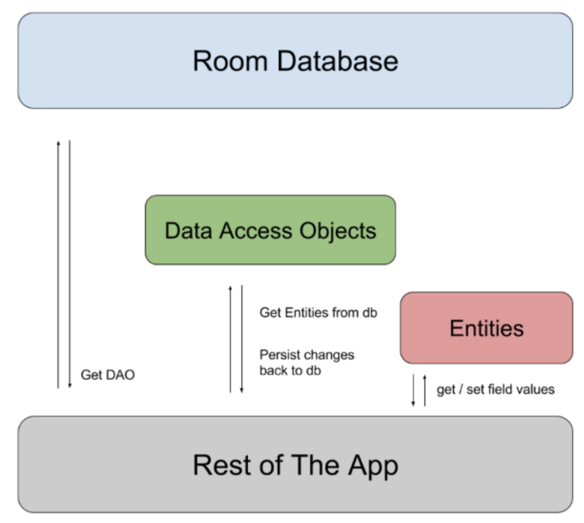

  

오늘은 안드로이드 Jetpack의 섹션 중 하나로 테스트와 유지관리가 쉬운 앱을 디자인하도록 돕는 라이브러리인 AAC(Android Architecure Components)에 대해서 알아볼 것이다.

AAC에 대해서 이해하면서 앱개발에 이 라이브러리를 적용하고 안하고는 정말 앱의 효율성과 유지보수성 등에 아주 큰 영향을 미칠정도로 중요하다고 볼 수 있다.

### AAC(Android Architecture Components)란?

---

AAC(Android Architecture Components)는 테스트와 유지보수가 쉬운 앱을 디자인할 수 있도록 돕는 라이브러리의 모음이다.

구글에서 2017년도에 발표했으며 5개로 시작했지만 현재는 아래의 8개로 구성되어있다.

**Lifecycles(Easy handling lifecycles)**

**LiveData(Lifecycle aware observable)**

**ViewModel(Managing data in a lifecycle)**

**Room(object Mapping for SQLite)**

**Paging(Gradually loading information)**

**Databinding**

**Navigation**

**WorkManager**

  
### Lifecycles

---

Lifecycles는 크게 2가지로 구성되어 있고 라이브러리 이름 답게 생명주기의 모니터링을 돕는다.

##### Lifecycle Owner

바로 이전 포스팅에서 다루었던 LiveData를 사용할 때 생명주기를 모니터링 하기 위해 호출했던 Lifecycle 객체이다.

Activity,Fragment에서 생명주기를 분리하여 Lifecycle 객체에 담고 Lifecycle 객체를 통해 다른 곳에서 해당 화면의 생명주기를 모니터링 할 수 있는데 자신의 생명주기를 담은 Lifecycle 객체가 Lifecycle Owner이다.

##### Lifecycle Observer

생명주기를 Wrapping한 Lifecycle Owner 객체를 통해 화면 밖에서도 모니터링이 가능하지만, 생명주기에 따른 동작을 계속 화면에서 정의하기는 힘들다.

화면 밖에서도 생명주기에 따른 동작을 정의하기 위해서는 원하는 클래스에 LifecycleObserver 인터페이스를 구현하고 넘겨받은 Lifecycle Owner객체에 구현한 LifecycleObserver를 등록해야 한다.

Lifecycle Observer를 구현한 클래스는 onResume()등의 생명주기 메소드를 정의할 수 있는데 이 메소드들은 등록한 Lifecycle Owner가 해당 생명주기 상태가 되면 자동으로 수행되면서 객체가 화면과 동일한 생명주기를 가진 것처럼 행동한다.

  
### LiveData

---

바로 이전 포스팅에서 다루었던 LiveData다.

LiveData는 Observable 형태로 사용하며 안드로이드 Lifecycle에 따라 데이터를 관리한다.

Activity, Fragment의 라이프 사이클을 따르기에 활동에 대한 처리를 알아서 관리해준다.

LiveData는 다음과 같은 장점을 가진다.

**LiveData는 observable 패턴을 사용하기에 데이터의 변화를 구독한 곳으로 통지하고, 업데이트 한다.**

**메모리 누수 없는 사용을 보장한다.**

**Lifecycle에 따라 LiveData의 이벤트를 제어한다.**

**항상 최신 데이터를 유지한다.**

**기기 회전이 일어나도 최신데이터를 처리할 수 있도록 도와준다. (AAC-ViewModel과 함께 사용시)**

**LiveData의 확장을 지원한다.**

자세한 사항은 이전 포스팅을 참고하기 바란다.

[안드로이드 LiveData 기본 사용법](https://nam8399.github.io/android/androidpost/ "LiveData")

  
### ViewModel

---

수명주기를 고려하여 UI관련 데이터를 저장하고 관리하도록 설계되었고 ViewModel 클래스를 사용하면 화면전환과 같이 구성을 변경할 때도 데이터를 보존할 수 있다.

AAC ViewModel이 데이터의 보존이 가능한 이유로는 ViewModel이 Activity의 경우 LifecycleEventObserver()로 Fragment에서는 FragmentStateManager로 View의 Lifecycle을 관찰하다 View가 종료되었을 때 Clear()를 하기때문에 종료가 되지 전까지 데이터가 보존되는 것이다.

그래서 위의 라이브러리들과 함께 사용할경우 훨씬 더 좋은 효율을 얻을 수 있다.

  

### Room

---

Room Dabase는 SQLite 개체 매핑 라이브러리이다. 

Room을 사용하여 사용구 코드를 피하고 SQLite 테이블 데이터를 자바 객체로 쉽게 변환할 수 있다. 

Room은 SQLite 문의 컴파일 시간 확인을 제공하며 RxJavam, Flowable, LiveData, Observable을 반환할 수 있다.

##### Room의 구성요소

데이터베이스 : 데이터베이스는 앱에 저장되어 있는 로컬 데이터에 대한 액세스 포인트를 제공해주는 역할

DAO(Data Access Object) : DAO는 앱에서 데이터베이스의 데이터를 추가, 삭제, 업데이트 작업을 할 수 있는 메소드를 제공해주는 역할, 그 외에도 다양한 쿼리 사용가능

Entity : 데이터베이스 내에 존재하는 테이블을 가리킵니다.

  

### Paging

---

페이징 라이브러리를 사용하면 로컬 저장소에서나 네트워크 를 통해 대규모 데이터세트의 데이터 페이지를 로드하고 표시할 수 있다. 

이 방식을 사용하면 앱에서 네트워크 대역폭과 시스템 리소스를 모두 더 효율적으로 사용할 수 있다.

  

### Databinding

---

선언형 형식으로 Data를 UI에 쉽게 Binding하기 쉽게 해주며 findViewById에 의한 객체 획득 번거로움을 제거해주는 라이브러리이다.

Activity에서 따로 View들을 정의해서 사용하지 않아도 되고 Data를 view에 연결시켜두면 data가 변할 때 따로 셋팅해주지 않아도 변경되게 할 수 있다.

이 라이브러리 같은 경우는 조만간 따로도 한번 포스팅할 예정이다. 

  

### Navigation

---

사용자가 앱 내의 여러 콘텐츠를 Navigation(탐색)하고 그곳에 들어갔다 나올 수 있게 하는 상호작용을 의미한다.
또한 View의 흐름을 직관적으로 보여주기 때문에 앱의 동작흐름을 파악하는데도 도움이 된다.

  

### WorkManager

---

WorkManager는 지속적인 작업에 권장되는 솔루션이며 앱이 다시 시작하거나 시스템이 재부팅될 때 작업이 예약된 채로 남아있으면 그 작업은 유지된다. 

대부분의 백그라운드 처리는 지속적인 작업을 통해 가장 잘 처리되므로 WorkManager는 백그라운드 처리에 권장하는 기본 API이다.

  
### 마무리

---

오늘은 AAC의 정의와 간단하게 어떤 라이브러리들로 구성되어 있는지 알아보았다.

내가 최종적으로 원하는 회사에서도 AAC에 대한 이해 및 서비스에 적용 경험이 있는 사람을 우대사항도 아닌 기본 자격요건으로 둘정도로 AAC는 안드로이드 개발을 하는데에 있어서 굉장히 중요하다는 것을 알 수 있다.

앞으로 사이드 프로젝트를 할 때 AAC 라이브러리들을 많이 사용하며 부족한 부분을 채워나갈 예정이다.
